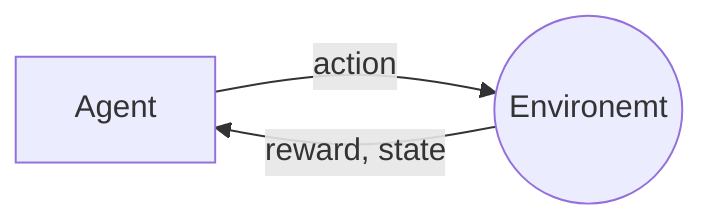

# RL-PID

## RL Environments

The reinforcement learning environments defines the world where the RL-agent(decision maker)
gain experience by taking action that changes the environment, this action could induce a
positive change environment or even become adverse. 

## Rewards

 
The changes in the system(environment) is provided to RL-agent via. `scalar` quantity, and
the RL-agents updates itself based on this `reward` signal.

